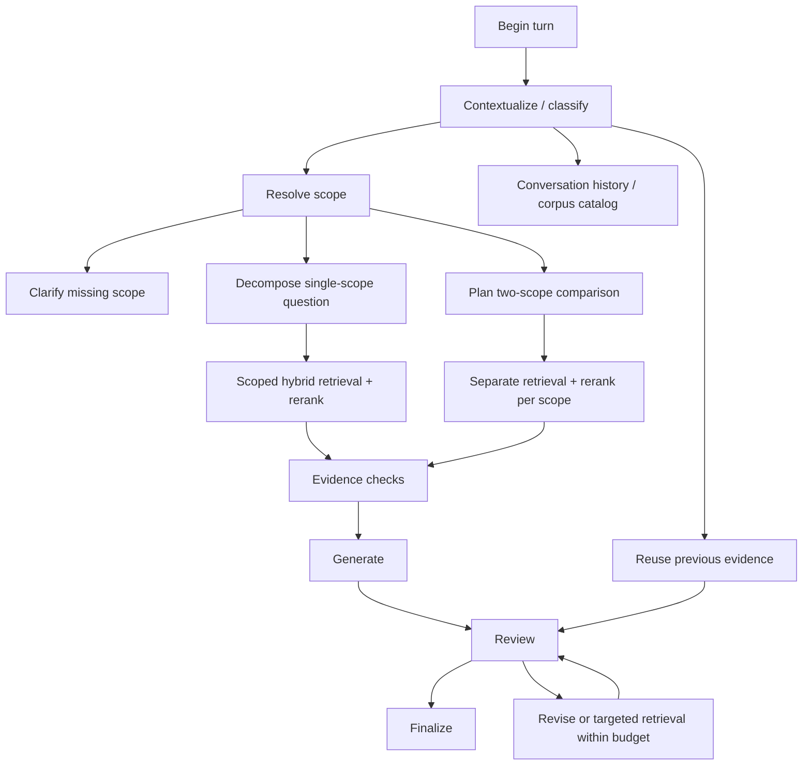

# Architecture

The application is a controlled RAG workflow with LLM interpretation and review.
Python defines allowed paths, lender/version boundaries and retry budgets. The
model supplies semantic judgments and query decomposition within those boundaries.

## Runtime paths

This diagram groups related nodes. In code, targeted retrieval returns through
reranking, evidence checks and generation; revisions return to review. Comparison
has separate nodes and evidence partitions. See `src/graph/pipeline.py:build_graph`
for the exact edges and correction modes.

## Source map

| Responsibility | Source |
| --- | --- |
| FastAPI endpoints and browser UI | `src/app/server.py`, `src/app/static/index.html` |
| State schema, nodes and edges | `src/graph/pipeline.py` |
| Turn execution/history and diagnostics | `src/graph/runtime.py` |
| Follow-ups and deterministic scope filters | `src/resolve/` |
| Parsing, chunks, diagram captions | `src/ingest/` |
| Dense/sparse embeddings and caches | `src/embed/` |
| Qdrant filtering/retrieval | `src/store/qdrant_store.py` |
| Reranking and generation | `src/rerank/`, `src/generate/` |
| Semantic review and corrective routing | `src/graph/answer_review.py`, `pipeline.py` |
| Checks and redaction | `src/guardrails/` |
| Durable app tables and legacy diagnostic log | `src/store/state_store.py`, `conversations.py` |
| Index artifacts and aliases | `src/store/index_builds.py`, `index_context.py` |

## State, context and persistence

`RAGState` contains conversation fields, scope, candidates, selected evidence,
answer, retry bookkeeping and diagnostics. Nodes return state updates. LLM prompts
use selected state values plus instructions. Fresh turns reset transient fields
while preserving useful conversation information.

`build_graph(checkpointer=PostgresSaver(...))` attaches checkpoint storage at
compile time. Runtime invocations carry `thread_id`; checkpoints persist progress
at execution boundaries. App-owned tables separately hold transcript, ownership
and turn-execution records. SQLite is a local diagnostic/cache layer, not the graph
checkpointer. Qdrant holds corpus vectors and payloads.

## Index lifecycle lab

`scripts/manage_index.py` offers capture, prepare, install, validate, bootstrap,
promote, rollback and reconcile subcommands. Read each subcommand's `--help`.
`scripts/run_index_eval.py` compares builds with fixed retrieval budgets.
`scripts/verify_index_release.py` rehearses alias changes and checkpoint pins.

Build artifacts and vector exports are local under `data/index_builds/`; they
are not distributed with this repository. Bootstrap your own builds before setting
`RAG_INDEX_ALIAS`. A new turn then resolves the alias to a concrete build.
Resume/retry preserves that turn's pin; another turn may use a promoted build.
Reusing earlier evidence preserves its provenance. Filesystem artifacts and local
locking are learning implementations, not a distributed release service.

The quickstart uses the unaliased `uw_manual` collection. It does not silently
opt into the advanced release workflow.
